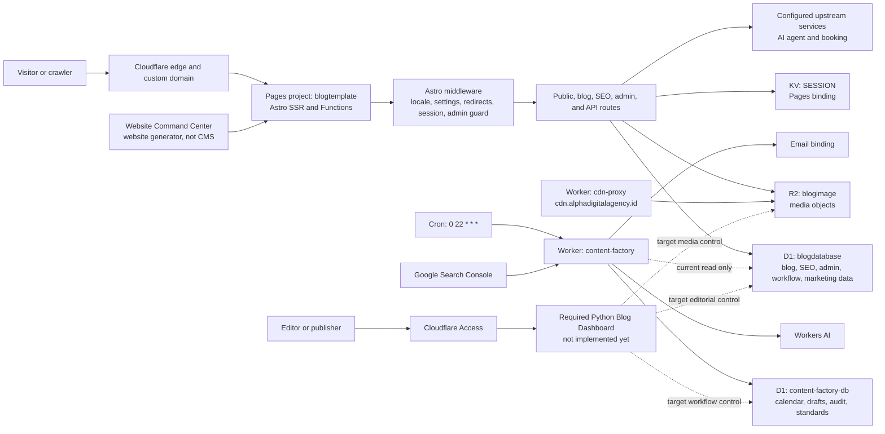
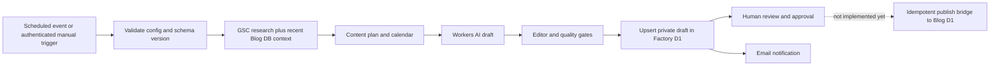

# Alpha Digital Agency — Architecture and LLM Coding Guide

**Document type:** Verified as-built architecture, engineering rules, and LLM execution contract  
**System:** `alphadigitalagency.id`  
**Audience:** Coding LLMs and engineers working in this repository  
**Last verified:** 2026-08-28  
**Safety class:** Alpha production contains live data. Remote writes and deployments require explicit approval.

## 0. Purpose

Use this document to understand Alpha before changing code. It records:

- the live Cloudflare topology;
- the repository topology;
- the main HTTP, database, media, authentication, SEO, and content-generation flows;
- known differences between production and the repository;
- rules and acceptance gates another LLM must follow.

This is the primary context document for Alpha code changes. For public page classification, keyword ownership, hotel/villa offer boundaries, and SEO landing-page work, also read [SEO_PAGE_TAXONOMY_LLM_GUIDE.md](SEO_PAGE_TAXONOMY_LLM_GUIDE.md). For the normalized, client-replicable blog product, also read [BLOG_PLATFORM_LLM_IMPLEMENTATION_SPEC.md](BLOG_PLATFORM_LLM_IMPLEMENTATION_SPEC.md). For the required editorial control plane, read [PYTHON_BLOG_DASHBOARD_LLM_SPEC.md](PYTHON_BLOG_DASHBOARD_LLM_SPEC.md). For each coding request, complete [templates/llm-coding-task.example.md](templates/llm-coding-task.example.md).

## 1. Instructions To The Coding LLM

Copy this instruction with the relevant task packet:

> Read `docs/ALPHA_ARCHITECTURE_LLM_CODING_GUIDE.md`, the completed LLM coding task, and every referenced specification before editing. Inspect the current files and Git status. Preserve unrelated changes. Distinguish verified production behavior from repository behavior. Do not mutate, migrate, deploy, delete, or rebind any remote resource without explicit production approval. Never run `schema.sql` against D1. Use additive migrations, parameterized SQL, generated Cloudflare types, explicit error semantics, and local or preview verification. If source, configuration, database schema, and live behavior disagree, stop the affected release path and report the evidence; do not invent a silent compatibility assumption.

The LLM must finish with:

1. files changed and the reason for each change;
2. commands run and their exact pass/fail result;
3. database and binding assumptions used;
4. routes and flows tested;
5. remaining risks or blockers;
6. confirmation whether any remote state was changed.

## 2. Source-Of-Truth Rules

Alpha currently has configuration and source drift. No single artifact describes the whole deployed system.

Use this evidence order:

1. **Explicit task scope and safety limits** decide what may be changed.
2. **Current live measurements and Cloudflare resource inspection** describe what production is doing now.
3. **Current repository files** describe the implementation available to edit.
4. **Remote D1 schema inspection** describes existing production data contracts.
5. **Versioned migrations** describe intended schema history, but are not proof that production matches them.
6. **This guide and older documents** provide context; re-verify any fact that controls a destructive or production operation.

Important consequence: a successful live page does not prove that the same repository revision will build or reproduce it. A local migration does not prove that the live database has that shape.

## 3. Verified Status Snapshot

Verified on 2026-08-28:

| Area | Verified state | Engineering meaning |
|---|---|---|
| Public routes | `/`, `/en`, `/blog`, `/en/blog`, `/sitemap.xml`, and `/robots.txt` return `200` | The public indexes and crawl endpoints are currently available |
| English detail convention | Live links use `/blog/<slug>-en`; a tested `/en/blog/<slug>` equivalent returned `404` | Preserve current URLs during stabilization; treat `/en/blog/<slug>` as a target convention, not current fact |
| Pillar routes | Live `/blog/pillar/<pillar>` and `/en/blog/pillar/<pillar>` routes return `200` | These live routes are absent from the inspected repository source |
| Pages project | Production project is `blogtemplate`, deployed without a configured Git provider | A deployed revision cannot currently be traced reliably to this worktree or a commit |
| Root website build | `npm run build` reports 28 TypeScript errors | The repository is not release-ready even though production is serving traffic |
| Content Factory | TypeScript check and Wrangler dry-run pass | Its current package is locally deployable, subject to security and workflow issues below |
| CDN proxy | Wrangler dry-run passes with an environment warning | Configuration still needs environment and route verification |
| Blog D1 | `blogdatabase`: 113 posts; 108 published, 5 unpublished; 59 Indonesian, 54 English | Preserve live rows and adapt; do not replace the table |
| Factory D1 | `content-factory-db`: workflow/metrics/drafts tables; no drafts returned at inspection time | The draft inbox exists but the approval-to-publish bridge is not implemented |
| R2 | `blogimage` is the relevant website media bucket | Binding names differ between production config and repository code |

Counts and runtime observations are dated evidence, not constants. Re-query before a migration, audit, or release.

## 4. As-Built System Topology



### Component ownership

| Component | Responsibility | Main repository location |
|---|---|---|
| Astro website | Replaceable marketing UI, blog rendering, SEO, APIs, admin UI | `src/`, `astro.config.mjs` |
| Pages configuration | Website build output, compatibility settings, bindings and variables | Production Pages config and root `wrangler.toml` |
| Blog D1 | Current public content plus legacy admin/SEO/marketing tables | Remote `blogdatabase`; root `migrations/` are only partial intent |
| R2 media | Images delivered by the website route and CDN Worker | `src/pages/images/[...path].ts`, `workers/cdn-proxy/` |
| Session/auth | Signed admin session and credential verification | `src/lib/auth.ts`, `src/lib/session.ts`, `src/middleware.ts` |
| Content Factory | Research, planning, AI drafting, quality control, inbox storage, email | `workers/content-factory/` |
| Factory D1 | Private workflow state and generated drafts | `workers/content-factory/migrations/` |
| Website Command Center | Generates/replaces website presentation; it is not the blog CMS | Protected external application at `website.alphadigitalagency.id/website` |
| Python Blog Dashboard | Required editorial CMS/control plane for posts, media, translations, SEO, review, publication, and audit | Target `apps/blog-dashboard/`; not implemented yet |
| SEO delivery | Metadata, canonical/hreflang, schema, sitemap, robots, URL status | layouts, schema helper, blog routes, SEO endpoints |

## 5. Runtime And Binding Contract

### Production Pages bindings observed

| Binding or variable | Production state | Repository expectation | Required action before release |
|---|---|---|---|
| `DB` | D1 binding exists | Used throughout website code | Verify schema compatibility for every changed query |
| `SESSION` | KV binding exists | Astro/session support expects it | Declare it in generated runtime types and per-environment config |
| `IMAGES` | R2 binding exists | Image route expects `BLOG_IMAGE` | Resolve one binding name; do not assume aliases exist |
| `AI` | Workers AI binding exists | Not central to inspected public routes | Keep only if intentionally owned by this app |
| `AI_AGENT_UPSTREAM` | Production variable exists | Used for an upstream service | Parameterize per environment/client |
| `BOOKING_UPSTREAM` | Production variable exists | Used for an upstream service | Parameterize per environment/client |
| `PUBLIC_GA4_ID` | Production variable exists | Public analytics configuration | Replace for every client; never copy Alpha analytics ownership |
| `SESSION_SECRET` | Secret required by source | Must not be committed or printed | Verify existence through secret metadata only |
| `ADMIN_PASS` | Bootstrap secret supported by source | Must not be a permanent shared password | Remove bootstrap behavior after controlled admin creation |

The checked-in root `wrangler.toml` uses project name `alpha-digital-agency`, an older compatibility date, D1 `DB`, and R2 `BLOG_IMAGE`. It does not fully declare the production Pages environment, KV, AI, upstream variables, or deployed project name. Treat this as configuration drift, not an interchangeable production configuration.

### Standalone Worker bindings

| Worker | Binding | Purpose |
|---|---|---|
| `content-factory` | `CF_DB` | Private calendar, metrics, audit, standards, and drafts |
| `content-factory` | `BLOG_DB` | Current read-only access to public blog data |
| `content-factory` | `AI` | Planning/writing/editor model calls |
| `content-factory` | `EMAIL` | Completion or operational email |
| `cdn-proxy` | `BLOG_IMAGE` | R2 image reads for CDN host |

Generate binding types from Wrangler configuration after the configuration is reconciled. Do not expand hand-written `Env` interfaces indefinitely.

## 6. Route Contract

### Public and locale routes

- Indonesian/default marketing routes live at `/...`.
- English marketing routes generally live at `/en/...`.
- Locale detection and redirect behavior are partly implemented in middleware.
- Marketing UI is client-replaceable. Blog/database contracts must not depend on Alpha's visual components.

### Blog routes: current production versus target

| Purpose | Current live convention | Inspected repository | Client target |
|---|---|---|---|
| ID index | `/blog` | `/blog` | Manifest-defined, normally `/id/blog` or `/blog` |
| EN index | `/en/blog` | `/en/blog` | `/en/blog` |
| ID detail | `/blog/<slug>` | `/blog/<slug>` | Locale-prefix policy from manifest |
| EN detail | `/blog/<slug>-en` | `/en/blog/<slug>` | `/en/blog/<slug>` without locale encoded in slug |
| Pillar | `/blog/pillar/<pillar>` and `/en/blog/pillar/<pillar>` | Not found in inspected source | Explicit, tested route contract |

During Alpha stabilization, do not delete or silently change indexed live URLs. Introduce redirects and canonical/hreflang changes only with a complete URL map and crawl validation.

### Functional route groups in the repository

| Route group | Function |
|---|---|
| `/`, `/en`, service/product/demo pages | SSR marketing pages |
| `/blog`, `/en/blog`, detail routes | D1-backed blog listing and article rendering |
| `/sitemap.xml`, `/robots.txt` | Crawl discovery and indexing directives |
| `/images/<key>` | R2 object delivery through the website domain |
| `/api/contact`, `/api/subscribe` | Lead and subscriber intake |
| `/admin/**` | Protected admin pages |
| `/api/admin/login`, `/logout`, `/posts/**`, `/settings` | Session creation and admin CRUD/settings |

Status semantics are mandatory:

- `200`: requested representation exists and is valid;
- `301` or `308`: permanent canonical route change;
- `302` or `307`: genuinely temporary redirect;
- `404`: route or eligible published content does not exist;
- `410`: intentionally removed content when configured;
- `500`: unexpected application or database failure;
- `503`: known temporary dependency outage.

Never translate a D1 exception, missing binding, or invalid schema into an empty `200` or fake `404`.

## 7. Request And Data Flows

### 7.1 Public page request

1. Cloudflare routes the domain to the Pages project.
2. Astro middleware determines locale and checks redirect/gone mappings.
3. Middleware attempts to load `site_settings` from `DB` and reads the signed session when relevant.
4. The matching SSR route loads its data and renders the shared layout.
5. The layout emits metadata, canonical/hreflang where configured, analytics, and navigation.
6. Exceptions must be logged with a correlation/error ID and preserve correct HTTP status.

Current risk: reading settings on every request increases D1 coupling. Cache only after defining invalidation and safe fallback behavior.

### 7.2 Blog listing and detail

1. Route selects locale from the route contract, not only from a slug suffix.
2. Repository queries `DB` using the actual current schema adapter.
3. Listing returns only eligible published rows in deterministic order.
4. Detail returns one locale/slug match or a real `404`.
5. Rendering maps legacy fields into a stable domain model.
6. SEO output uses the final canonical URL and verified translation relation.

For Alpha's current legacy table, mappings include `content -> body`, `description -> meta description/excerpt`, `hero_image -> hero`, `is_published -> publication state`, and `pub_date -> publish time`. Keep these mappings inside a repository adapter rather than duplicating them in pages.

### 7.3 Media

1. HTML stores or derives an R2 object key.
2. `/images/<key>` or the CDN host reads the object from the configured R2 binding.
3. Response preserves object content type and intentional cache metadata.
4. Unknown objects return `404`; binding/storage errors return `500` or `503`.
5. Published media keys should be immutable/versioned so long-lived caching is safe.

### 7.4 Admin authentication and CRUD

1. Login verifies the admin credential using PBKDF2-SHA256.
2. A signed, HTTP-only session cookie is issued.
3. Middleware protects `/admin` and `/api/admin` paths.
4. CRUD endpoints must authorize before reading or changing content.
5. Queries must use a schema adapter that matches the live database.
6. Every content mutation needs actor, timestamp, target, previous state, new state, and request ID in an audit record.

Current risk: root admin APIs target the newer migration-0002 post shape, while production uses the legacy post shape. They are not safely interchangeable.

### 7.5 Contact and subscription

1. API validates method, content type, normalized values, size, consent, and anti-abuse controls.
2. It writes through a single lead repository contract.
3. Duplicate handling is explicit and idempotent where possible.
4. It returns structured success/error JSON without leaking database internals.

Current risk: source expects tables such as `contacts`, `inquiries`, and `leads`, while the inspected live database exposes `contact_submissions` and `subscribers` but not the entire expected set. Reconcile before relying on these endpoints.

### 7.6 Content Factory



The current Worker initializes some schema at runtime, writes generated drafts to Factory D1, reads recent public posts, and emails results. It does not provide the required reviewed, auditable publication bridge.

Security debt to fix before client reuse:

- manual trigger must not fall back to a default key;
- secrets must not appear in query strings;
- `/status` must expose only intentionally public health data or require authorization;
- runtime schema creation must be replaced by versioned migrations;
- Alpha domain, GSC property, author, email, brand, and standards must come from the client manifest/configuration.

### 7.7 Website builder and Python Blog Dashboard

`website.alphadigitalagency.id/website` is the protected Website Command Center used to create or replace website presentation. It is not the content-management system.

The required target flow is:

1. Website Command Center creates or updates the replaceable public website.
2. Python Blog Dashboard, protected by Cloudflare Access, owns editorial operations.
3. Editors manage drafts, revisions, translations, SEO, and R2 media in the dashboard.
4. Reviewers approve an exact immutable draft hash.
5. Publishers execute an idempotent publish flow from Factory DB into Blog DB.
6. The generated website reads only published Blog DB data and versioned R2 media.
7. Replacing the website does not move or recreate blog editorial data.

The normative implementation is [PYTHON_BLOG_DASHBOARD_LLM_SPEC.md](PYTHON_BLOG_DASHBOARD_LLM_SPEC.md). Python is a required target component, but no Python code currently exists in this repository.

## 8. Database Architecture

### 8.1 Current Blog D1

`blogdatabase` is a legacy monolithic database. It includes public posts plus authors, taxonomy, admin/session, SEO research, content-workflow, comments, contact/subscriber, settings, and analytics-support tables.

The live `posts` columns observed are:

`id`, `slug`, `title`, `description`, `content`, `hero_image`, `author`, `pub_date`, `updated_at`, `is_published`, `view_count`, `created_at`, `faq`, `howto_steps`, `language`, `excerpt`, `pillar_id`, `node_type`, `upward_links`, `last_audit_date`, `decay_status`, `author_id`, `hero_alt`.

The root `migrations/0002_posts_table.sql` defines a different target shape using fields such as `body_md`, `meta_description`, `hero_image_url`, `status`, and `publish_at`. Therefore:

- never run a destructive reset to make production match local code;
- never use `schema.sql` remotely because it begins with `DROP TABLE` operations;
- introduce a typed legacy adapter first;
- export and verify production data before any transformation;
- rehearse migrations on an isolated copy;
- use additive, immutable, versioned migrations;
- verify row counts, publication counts, URL mappings, and content hashes before promotion.

### 8.2 Factory D1

`content-factory-db` owns private operational data: metrics, audit results, calendar, drafts, and content standards. It must remain separate from the public serving contract.

The inspected database had the expected functional tables but no visible `d1_migrations` ledger. Do not assume the existing production schema is migration-tracked. Establish a baseline deliberately and non-destructively.

### 8.3 Target client database boundary

For new clients, use the normalized two-database design in the blog implementation specification:

- Blog DB: stable public content, authors, taxonomy, translation/SEO relations;
- Factory DB: work items, draft versions, gates, approvals, audit events, publish receipts.

Publication crosses two independent D1 databases and therefore cannot rely on one SQL transaction. Use an idempotent receipt/saga flow with content hashes and verification.

## 9. Repository Map

| Path | Meaning | Warning |
|---|---|---|
| `astro.config.mjs` | Astro SSR and Cloudflare adapter | Confirm current adapter/deployment target |
| `wrangler.toml` | Checked-in website config | Does not match observed production Pages config |
| `src/middleware.ts` | Locale, settings, redirects, sessions, guards | Cross-cutting; regression-test all route groups |
| `src/lib/auth.ts` | Password hashing/verification | Never weaken iteration count or leak credential detail |
| `src/lib/session.ts` | HMAC cookie session | Requires strong secret, expiry, secure cookie policy |
| `src/lib/settings.ts` | Site settings access | Schema and per-request behavior need verification |
| `src/lib/schema.ts` | Structured-data helpers | Client entities must be configurable |
| `src/pages/blog/**` | Default-locale blog | Currently written against legacy fields |
| `src/pages/en/blog/**` | English blog | Source route differs from deployed English detail URLs |
| `src/pages/api/**` | Public/admin APIs | Validate auth, input, schema, and error semantics |
| `src/pages/images/**` | Main-domain R2 delivery | Binding mismatch exists |
| `src/pages/sitemap.xml.ts` | Dynamic sitemap | Must include only canonical eligible URLs |
| `src/pages/robots.txt.ts` | Robots rules | Must point to production sitemap and avoid preview indexing |
| `migrations/` | Root intended schema history | Partial and drifted from production |
| `workers/content-factory/` | Scheduled AI content workflow | Alpha-specific defaults and trigger/status risks remain |
| `workers/cdn-proxy/` | R2 CDN Worker | Verify zone/route/environment ownership |

## 10. Known P0 Inconsistencies

An LLM must not deploy around these problems silently:

1. Live production code is not represented reliably by the current repository.
2. The root website does not pass its build/type gate.
3. Production Pages project/configuration and root Wrangler configuration differ.
4. Production R2 binding is `IMAGES`; repository image code/config expects `BLOG_IMAGE`.
5. Production post schema and repository admin post schema differ.
6. Live English detail URL convention differs from repository routing.
7. Live pillar routes are not present in inspected repository routes.
8. Public form table expectations do not fully match the inspected remote schema.
9. Content Factory has no reviewed approval-to-publish bridge.
10. Content Factory manual trigger and status endpoint need hardening.
11. Runtime schema initialization and missing migration ledger weaken reproducibility.
12. CDN route configuration needs zone/environment validation.
13. Hand-written binding types and widespread `any` weaken compile-time safety.
14. There is no implemented Python layer, but the Python Blog Dashboard is now a required target component because Website Command Center is a website generator, not a CMS.

## 11. LLM Work Modes

Every task packet must select one mode.

### Mode A — Diagnosis only

- Read files, inspect local state, query remote state read-only, and run non-mutating tests.
- Do not edit code, change Cloudflare state, or deploy.
- Return cause, evidence, impact, and recommended next action.

### Mode B — Alpha local implementation

- Edit only authorized repository files.
- Use local D1, mocks, or preview resources.
- Do not apply remote migrations or deploy.
- Finish at a verified patch plus explicit release instructions.

### Mode C — Reusable/client implementation

- Implement against a completed client manifest.
- Never copy Alpha IDs, data, content, analytics, GSC properties, secrets, authors, or contact information.
- Use isolated per-client resources and staging first.

### Mode D — Production operation

- Requires explicit approval naming the project/resource, environment, exact command/action, expected effect, verification, and rollback.
- Re-check targets immediately before execution.
- Capture deployment/migration identifiers and smoke-test evidence.

## 12. Required Engineering Rules

### Cloudflare and TypeScript

- Keep compatibility dates intentional and reviewed; do not change them incidentally.
- Define bindings in Wrangler configuration and generate runtime types from that configuration.
- Avoid `any` for D1 rows, JSON responses, environment bindings, and route parameters.
- Validate untrusted JSON and form input at runtime; TypeScript types alone are not validation.
- Store secrets with Cloudflare secrets, never plain variables or Git files.
- Never provide insecure fallback values for authentication secrets.
- Use `ctx.waitUntil()` for work that may continue after an HTTP response.
- Do not keep request-specific mutable state in module globals.
- Emit structured logs with event, component, request/run ID, result, duration, and safe error category.

### D1

- Use parameterized statements for all values.
- Select explicit columns; do not rely on `SELECT *` in stable application contracts.
- Keep database access behind typed repositories/adapters.
- Use additive, immutable migrations and apply them locally first.
- Never create or alter schema opportunistically during a normal request or scheduled run.
- Paginate list APIs and bound every query.
- Design idempotency keys for external retries and publish operations.
- Do not claim an atomic transaction across separate D1 databases.

### HTTP and security

- Authenticate before sensitive reads and writes.
- Use constant-time comparison for secrets/tokens where applicable.
- Do not put secrets in URLs, logs, analytics, or error bodies.
- Validate method, origin/CSRF strategy, content type, body size, and field constraints.
- Rate-limit or bot-protect public mutation endpoints.
- Use secure, HTTP-only, same-site cookies with explicit expiry.
- Return stable JSON error shapes and a safe correlation ID.

### SEO and content

- Canonical must match the final indexable URL.
- Hreflang must be reciprocal and based on an explicit translation relationship.
- Sitemap includes only canonical, published/time-eligible URLs.
- Preview, admin, API, and private workflow URLs must not be indexable.
- Preserve existing indexed URLs until redirects and a verified URL map are ready.
- Render Article schema from the same canonical content model used by HTML metadata.
- AI content cannot publish automatically; approval, immutable artifact hash, actor, and audit trail are required.

### Client replication

- Website presentation is replaceable; blog/domain contracts stay behind adapters and services.
- Editorial operations live in the Python Blog Dashboard; generated websites are read-only consumers of published content.
- All brand, locale, domain, author, email, analytics, GSC, resource, and SEO entity values come from a manifest or environment.
- One client's production D1, R2, secrets, analytics, and content must never be shared with another client.

## 13. Safe Implementation Procedure

1. Complete the LLM task template.
2. Read this guide and the relevant normative specification.
3. Inspect `git status`, authorized files, package versions, and applicable instructions.
4. Verify the affected route, binding, and actual database columns read-only.
5. State the current contract and desired contract before editing.
6. Add a compatibility adapter or migration boundary; do not scatter legacy conditionals through pages.
7. Implement the smallest scoped change and preserve unrelated edits.
8. Run focused tests, type checks, build, Worker dry-runs, and local migration tests.
9. Test the HTTP/status/SEO matrix against local or preview first.
10. Report drift and blockers. Do not reinterpret a failed gate as acceptable because production currently works.
11. Request separately scoped approval for any production operation.
12. After an approved release, run smoke tests and record rollback evidence.

## 14. Verification Matrix

Run only commands appropriate to the selected task. These commands were checked against the repository structure; current baseline failures are noted.

```powershell
# Root website: currently fails with 28 TypeScript errors
npm run build

# Content Factory: currently passes
npx tsc --noEmit -p workers/content-factory/tsconfig.json
Set-Location workers/content-factory
npx wrangler deploy --dry-run

# CDN Worker: dry-run currently passes with an environment warning
Set-Location ../cdn-proxy
npx wrangler deploy --dry-run
```

For D1 work, use a local database and the correct configuration directory. Apply migrations in order from an empty local database and again against a representative legacy fixture. Never replace `--local` with `--remote` without explicit approval and a named target.

### Minimum route smoke tests

| Test | Expected result |
|---|---|
| Root and both locale indexes | `200` |
| Known blog detail per current contract | `200` |
| Unknown article | `404`, not empty `200` |
| Database unavailable | `500` or `503` with safe error ID |
| Old URL with approved mapping | permanent redirect to final canonical URL |
| Sitemap | `200`, valid XML, only canonical eligible URLs |
| Robots | `200`, correct sitemap URL and environment policy |
| Known R2 object | correct bytes, content type, and cache policy |
| Unknown R2 object | `404` |
| Admin unauthenticated | redirect or `401/403` according to route type |
| Admin authenticated | authorized action only, audit event written |
| Invalid public API input | `400/422`, no database mutation |
| Duplicate/retried mutation | documented idempotent outcome |

### SEO assertions for every published detail page

- exactly one canonical link;
- canonical returns `200` and is indexable;
- title, description, Open Graph, and Article schema agree;
- reciprocal locale alternates return `200`;
- sitemap contains the canonical and not duplicate variants;
- no accidental redirect chain;
- missing hero media does not convert valid HTML into `500`.

## 15. Production Approval Gate

Before requesting approval, provide:

- exact Cloudflare account/project/database/bucket/route by non-secret name;
- environment: preview, staging, or production;
- exact command or dashboard operation;
- read-only preflight evidence;
- rows/resources expected to change;
- backup/export location and verification;
- expected user-visible effect;
- smoke tests;
- rollback operation and decision owner.

Approval for editing repository code is not approval to deploy it. Approval to deploy a Worker is not approval to migrate D1 or change DNS.

## 16. Required Handoff Format

The implementing LLM returns:

```text
Outcome:
Mode and scope:
Files changed:
Architecture/contracts affected:
Database migrations:
Bindings/configuration:
Tests and commands:
HTTP/SEO verification:
Remote changes made: none | exact approved changes
Known risks/blockers:
Rollback/recovery notes:
Recommended next task:
```

Do not say “working” without command output or runtime evidence. Clearly separate failures that existed before the task from regressions introduced by the patch.

## 17. Definition Of Done

An Alpha coding task is done only when:

- the requested behavior is implemented within the authorized scope;
- repository and runtime contracts are reconciled or the remaining drift is explicitly blocked;
- all affected types, build/tests, migrations, and dry-runs pass, except clearly documented pre-existing failures outside scope;
- route status, data integrity, auth, SEO, and media behavior are verified in proportion to risk;
- no production mutation occurred without explicit approval;
- another engineer can reproduce the verification from the handoff.

A client-replication task has additional gates: a completed manifest, isolated resources, a Cloudflare Access-protected Python Blog Dashboard, staging proof, no Alpha-specific data/IDs, reviewed publication flow, analytics ownership, rollback proof, and client handover.

## 18. Authoritative Platform References

- [Cloudflare Workers best practices](https://developers.cloudflare.com/workers/best-practices/workers-best-practices/)
- [Cloudflare Pages bindings](https://developers.cloudflare.com/pages/functions/bindings/)
- [Cloudflare Pages Wrangler configuration](https://developers.cloudflare.com/pages/functions/wrangler-configuration/)
- [Wrangler environments](https://developers.cloudflare.com/workers/wrangler/environments/)
- [Wrangler configuration](https://developers.cloudflare.com/workers/wrangler/configuration/)
- [Cloudflare D1 migrations](https://developers.cloudflare.com/d1/reference/migrations/)
- [Cloudflare Python Workers](https://developers.cloudflare.com/workers/languages/python/)
- [FastAPI on Python Workers](https://developers.cloudflare.com/workers/languages/python/packages/fastapi/)
