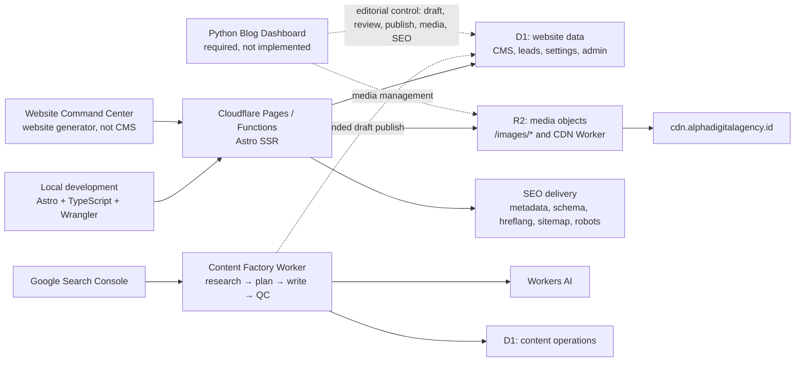

# Alpha Digital Agency System Blueprint — Documentation Index

**Website:** `alphadigitalagency.id`  
**Purpose:** Document the current system, stabilize it, and turn it into a repeatable client-account deployment model.  
**Status:** Documentation plan approved by repository evidence; client-template rollout is **not yet production-ready**.  
**Last reviewed:** 2026-08-28

> Terminology: this repository uses Cloudflare **R2** object storage. There is no `R1` binding. No Python code exists yet, but Python is now a required target: an Access-protected Blog Dashboard/CMS because Website Command Center generates websites and does not manage the blog.

## Primary LLM Build Document

- [Verified Alpha architecture, flow, and LLM coding guide](ALPHA_ARCHITECTURE_LLM_CODING_GUIDE.md)
- [Reusable Blog Platform — LLM Implementation Specification](BLOG_PLATFORM_LLM_IMPLEMENTATION_SPEC.md)
- [Python Blog Dashboard — LLM Implementation Specification](PYTHON_BLOG_DASHBOARD_LLM_SPEC.md)
- [LLM coding task template](templates/llm-coding-task.example.md)
- [Per-client blog manifest template](templates/client-blog-manifest.example.yaml)

## 1. Current System At A Glance

### Repository-backed inventory

| Layer | Current implementation | Primary source of truth | Readiness |
|---|---|---|---|
| Frontend/runtime | Astro 5 SSR with Cloudflare adapter | `astro.config.mjs`, `src/` | Implemented; build currently fails type checking |
| Cloudflare app config | Pages output, D1 `DB`, R2 `BLOG_IMAGE` | `wrangler.toml` | Implemented; needs environment separation and generated types |
| Website D1 | Live `blogdatabase` currently contains the public blog, CRM/CMS, and SEO data | remote D1 schema plus `migrations/0001`–`0004` | Schema drift exists; reconcile non-destructively before using the root migrations for production |
| R2 media | `blogimage` bucket through main-domain route and CDN Worker | `src/pages/images/[...path].ts`, `workers/cdn-proxy/` | Implemented; object-key convention needs one written standard |
| SEO foundation | Canonical, hreflang, Open Graph, JSON-LD, robots, dynamic sitemap, bilingual routes | `src/layouts/Layout.astro`, `src/lib/schema.ts`, SEO endpoints | Implemented; needs repeatable validation and client variables |
| Content factory | Scheduled GSC → plan → Workers AI → QC → D1 inbox → email flow | `workers/content-factory/` | Verified locally and by Worker dry-run; explicit human approval/publish flow remains to be built |
| Local development | npm/Astro plus Wrangler local D1 | `package.json`, `.env.example`, `migrations/README.md` | Partially documented |
| Python Blog Dashboard | No `.py`, `pyproject.toml`, or Python Worker config found | `docs/PYTHON_BLOG_DASHBOARD_LLM_SPEC.md` | Required target; implementation not started |

## 2. Required Document Set

The filenames below are the planned reusable operating manual. Documents marked **P0** must be completed and verified before the first client clone.

| ID | Planned document | Priority | What it must answer | Status |
|---|---|---:|---|---|
| DOC-00 | `docs/ALPHA_SYSTEM_BLUEPRINT_INDEX.md` | P0 | What documentation exists, what is missing, and in what order should it be produced? | **Created** |
| DOC-01 | `docs/ALPHA_ARCHITECTURE_LLM_CODING_GUIDE.md` | P0 | How do the verified live system, repository, routes, bindings, databases, Workers, SEO, and safe LLM implementation flow interact? | **Created** |
| DOC-02 | `docs/02-environment-and-resource-registry.md` | P0 | Which account, zone, Pages/Worker project, database, bucket, route, binding, secret, and owner belongs to each environment? | Planned |
| DOC-03 | `docs/03-local-development-runbook.md` | P0 | How does a new developer clone, configure, migrate, run, build, and test without touching production data? | Planned |
| DOC-04 | `docs/04-cloudflare-account-bootstrap.md` | P0 | How is a clean client Cloudflare account prepared, with least privilege and separate staging/production resources? | Planned |
| DOC-05 | `docs/05-d1-schema-migrations-backup.md` | P0 | How are both D1 databases created, migrated, seeded, validated, exported, restored, and rolled back? | Planned |
| DOC-06 | `docs/06-r2-media-and-cdn.md` | P0 | What is the bucket/key naming convention, upload process, cache policy, custom-domain flow, CORS policy, and purge/versioning strategy? | Planned |
| DOC-07 | `docs/07-seo-technical-standard.md` | P0 | What are the canonical, hreflang, sitemap, robots, status-code, redirect, schema, metadata, internal-link, and image requirements? | Planned |
| DOC-08 | `docs/08-client-replication-playbook.md` | P0 | Which variables change per client, which assets/data must never be copied, and what are the exact acceptance gates? | Planned |
| DOC-09 | `docs/09-secrets-security-and-access.md` | P0 | Where do secrets live, who owns them, how are they rotated, and how are admin/content endpoints protected? | Planned |
| DOC-10 | `docs/10-ci-cd-release-and-rollback.md` | P0 | What blocks a deployment, how are preview/staging/production promoted, and how is a bad release rolled back? | Planned |
| DOC-11 | `docs/BLOG_PLATFORM_LLM_IMPLEMENTATION_SPEC.md` | P0 | What exact architecture, schemas, functions, workflow, APIs, SEO rules, migrations, and tests must another LLM implement? | **Created** |
| DOC-12 | `docs/PYTHON_BLOG_DASHBOARD_LLM_SPEC.md` | P0 | How does the Access-protected Python dashboard manage posts, revisions, translations, media, SEO, approval, publication, and audit independently from the website builder? | **Created; implementation pending** |
| DOC-13 | `docs/13-observability-alerting-and-slo.md` | P1 | Which logs, error rates, cron results, D1 health, R2 misses, indexability checks, and alerts prove the system is healthy? | Planned |
| DOC-14 | `docs/14-analytics-consent-and-conversion-tracking.md` | P1 | How are GTM/GA4/GSC configured per client while respecting consent and data ownership? | Planned |
| DOC-15 | `docs/15-content-and-brand-localization.md` | P1 | Which brand, locale, service, location, author, legal, and contact fields must change for every client? | Planned |
| DOC-16 | `docs/16-test-plan-and-acceptance-checklist.md` | P0 | What automated and manual tests must pass before DNS cutover and indexing are allowed? | Planned |
| DOC-17 | `docs/17-incident-response-and-disaster-recovery.md` | P1 | What happens after a failed deploy, compromised secret, database loss, incorrect indexing, or broken media delivery? | Planned |
| DOC-18 | `docs/18-client-handover-and-ownership.md` | P1 | What credentials, exports, training, renewal duties, and acceptance evidence are handed to the client? | Planned |
| DOC-19 | `docs/19-cost-capacity-and-vendor-register.md` | P2 | What services can create cost, what limits matter, and who approves upgrades? | Planned |
| DOC-20 | `docs/20-alpha-reference-evidence.md` | P1 | Which Alpha routes, configurations, screenshots, tests, and performance/search reports prove the reference build? | Planned |

## 3. Supporting Templates

These should be created alongside the runbooks. They prevent client-specific values from being hardcoded into reusable instructions.

| Template | Purpose |
|---|---|
| `docs/templates/client-blog-manifest.example.yaml` | Non-secret blog-platform variables: client identity, domains, locales, resources, bindings, workflow, SEO, analytics, and operations |
| `docs/templates/llm-coding-task.example.md` | Per-change scope, runtime/database/HTTP contracts, safety authorization, tests, and required LLM handoff |
| `docs/templates/resource-registry.example.md` | Account IDs, zone IDs, project/database/bucket names, environments, owners, and backup locations |
| `docs/templates/seo-acceptance-checklist.md` | Crawl/indexing, status, canonical, hreflang, schema, sitemap, robots, metadata, internal links, performance |
| `docs/templates/deployment-checklist.md` | Preflight, migration, build, preview, approval, deploy, smoke test, rollback point |
| `docs/templates/client-handover-checklist.md` | Ownership, access, credentials, documentation, training, exports, sign-off |
| `docs/templates/content-brief.md` | Search intent, primary entity/topic, evidence, internal links, author, schema, CTA, QC |
| `docs/templates/incident-report.md` | Timeline, impact, cause, containment, recovery, evidence, follow-up actions |

## 4. Client Replication Model

Every client must receive isolated resources. Alpha’s production IDs, credentials, data, analytics properties, content, and author/entity schema must never be copied as client defaults.

### Variables that must change for every client

- Cloudflare account ID, zone ID, custom domains, DNS records, and routes.
- Pages/Worker names, D1 database names and IDs, R2 bucket names, and all binding declarations.
- Admin credentials, session secret, GSC OAuth credentials, email sender/recipient, and manual-trigger secret.
- Site origin, brand/entity name, logo, organization/person schema, address, contact details, social profiles, and legal pages.
- Languages, hreflang pairs, service areas, target topics, content pillars, internal-link graph, GTM/GA4/GSC properties, and conversion definitions.
- Backup destination, retention, alert recipients, budget owner, and client handover owner.

### Values that may remain reusable

- Astro component and route patterns after they are parameterized.
- Additive D1 migration approach and migration naming convention.
- R2 immutable-cache pattern when object keys are content-versioned.
- SEO validation rules, schema generators, sitemap/robots patterns, and editorial QC gates after client-specific entities are injected.
- CI quality gates, release process, incident format, and operational checklists.

## 5. P0 Findings Before This Can Be The Client Template

1. **The root build is red.** `npm run build` now reports 28 remaining website/admin TypeScript errors. The Content Factory package itself passes its type-check and Worker dry-run.
2. **Production database schema drift is real.** Live `blogdatabase.posts` uses the legacy public-blog fields (`content`, `description`, `hero_image`, `is_published`), while repository admin code and root migration `0002` expect the newer fields (`body_md`, `meta_description`, `hero_image_url`, `status`). Preserve all live posts (113 at the 2026-08-28 inspection) and introduce a tested compatibility/publish layer; do not reset the table.
3. **Content Factory requires an explicit approval-to-publish bridge.** It now saves generated content to `content-factory-db.content_drafts` and reads the public blog through `BLOG_DB`. A reviewed publish action must translate a draft into the target client's `posts` schema.
4. **Production migration tracking must be initialized deliberately.** `content-factory-db` has its tables but no `d1_migrations` ledger. Review and apply the versioned Content Factory migrations once before its first production deploy; do not assume the dashboard-created schema is tracked.
5. **Legacy `schema.sql` is destructive.** It begins with `DROP TABLE` statements and does not represent all live blog tables. Never run it against a client or production database.
6. **Python is required but not implemented.** Website Command Center is a website generator, not a CMS. Build the Python Blog Dashboard as the separate editorial control plane, starting read-only and using the normative dashboard specification.
7. **Generated binding types are incomplete.** `src/env.d.ts` declares D1 but not the `BLOG_IMAGE` R2 binding. Build output also reports Astro session support expecting a `SESSION` KV binding; the session design and binding requirement must be resolved and documented.
8. **Existing docs are stale in places.** `README.md`, `D1_SETUP.md`, and `DATABASE_INTEGRATION_PLAN.md` do not yet fully represent the verified production blog schema or new Content Factory inbox workflow.
9. **SEO implementation is present, SEO outcome evidence is not.** The repository shows technical signals, but ranking, traffic, conversions, Core Web Vitals, crawl/index coverage, and structured-data validity require dated GSC/GA4/PageSpeed or crawl evidence in DOC-20.
10. **Production and repository revisions are not aligned.** The deployed Pages project has no configured Git provider; live English article and pillar routes differ from inspected source, and production bindings differ from root Wrangler configuration. Capture the deployed artifact/configuration and reconcile it before the next production release.

## 6. Replication Gates

A client deployment is allowed only when all gates are green.

| Gate | Minimum evidence |
|---|---|
| Build | `npm run build` exits successfully with no TypeScript errors |
| Worker validation | Each standalone Worker passes type checking and `wrangler deploy --dry-run` in its own directory |
| Resource isolation | Client manifest and resource registry contain no Alpha production resource IDs or secrets |
| Database | Local and staging migrations apply from empty state; backup and restore are tested |
| Media | Known R2 object works through the chosen custom-domain path with correct type, cache, 404, and access behavior |
| Security | Secrets are stored outside Git; admin and manual-trigger endpoints are authenticated; rotation owner is named |
| SEO | Crawl finds only intended indexable URLs; canonical/hreflang/schema/sitemap/robots/status rules pass |
| Analytics | Client-owned GSC and analytics properties receive verified production data and conversions |
| Release | Preview/staging approval, production smoke test, and rollback point are recorded |
| Handover | Client access, ownership, documentation, exports, and sign-off are complete |

## 7. Documentation Production Order

1. Fix the build and binding/resource inconsistencies while writing DOC-01 and DOC-02 from verified state.
2. Write DOC-03 through DOC-07 and prove each command against local or staging resources.
3. Create the client manifest and write DOC-08, DOC-09, DOC-10, and DOC-16 as the replication control plane.
4. Stabilize the content factory, then write DOC-11 from a successful scheduled and manual test run.
5. Implement the Python Blog Dashboard from DOC-12 in phases: read-only Access-protected view, draft/media editing, reviewed publication, then client replication. Provisioning/audit automation remains a later extension.
6. Finish operations, evidence, disaster recovery, costs, and handover documents.
7. Run one internal dry-run clone into a clean non-production Cloudflare account before onboarding a client.

## 8. Documentation Rules

- Record commands only after they have been tested with the repository’s installed Wrangler version.
- Use placeholders such as `<CLIENT_SLUG>` and `<D1_DATABASE_ID>`; never paste live secrets into docs.
- Label every instruction as local, preview/staging, or production.
- Prefer D1 migrations over raw schema execution; do not edit an applied migration.
- Treat Git plus the resource registry as the declared configuration source; treat the Cloudflare dashboard as verification, not undocumented state.
- Every operational document needs: prerequisites, inputs, steps, verification, rollback, owner, and last-tested date.
- Every SEO claim needs dated evidence. Technical implementation alone is not proof of ranking or business performance.

## 9. Current Authoritative References

### Repository

- Application configuration: `astro.config.mjs`, `wrangler.toml`, `package.json`
- Database: `migrations/`, with `migrations/README.md`
- Runtime bindings and middleware: `src/env.d.ts`, `src/middleware.ts`
- SEO: `src/layouts/Layout.astro`, `src/lib/schema.ts`, `src/pages/sitemap.xml.ts`, `src/pages/robots.txt.ts`
- R2 delivery: `src/pages/images/[...path].ts`, `workers/cdn-proxy/`
- Content automation: `workers/content-factory/`
- Secrets template: `.env.example`

### Platform documentation

- [Cloudflare Astro on Pages](https://developers.cloudflare.com/pages/framework-guides/deploy-an-astro-site/)
- [Cloudflare Astro on Workers](https://developers.cloudflare.com/workers/framework-guides/web-apps/astro/)
- [Cloudflare D1 migrations](https://developers.cloudflare.com/d1/reference/migrations/)
- [Cloudflare R2 with Workers](https://developers.cloudflare.com/r2/api/workers/workers-api-usage/)
- [Wrangler configuration](https://developers.cloudflare.com/workers/wrangler/configuration/)

## 10. Definition Of Done For The Blueprint

The blueprint is complete when a second engineer can use only this document set and a client manifest to create an isolated staging system in a clean Cloudflare account, migrate and seed its databases, publish media, deploy the app and Workers, validate SEO and analytics, promote to production, roll back safely, and hand ownership to the client—without using Alpha’s live credentials, IDs, or data.
