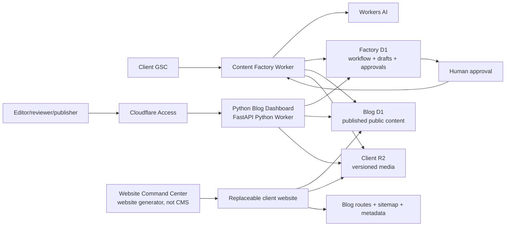

# Reusable Blog Platform — LLM Implementation Specification

**Document type:** Normative functional specification  
**Audience:** A capable coding LLM or engineer implementing the system in this repository  
**Scope:** Cloudflare Workers/Pages, D1, R2, content workflow, bilingual SEO, and client replication  
**Last verified:** 2026-08-28  
**Safety class:** Production data exists. All migrations must be additive and locally verified first.

## 0. How To Use This Document With Another LLM

Give the LLM:

1. This entire document.
2. A completed copy of `docs/templates/client-blog-manifest.example.yaml`.
3. The repository or a clean worktree.
4. The following instruction:

> Implement the specification exactly in phases. Inspect the repository before editing. Preserve unrelated user changes. Never mutate remote/production resources without explicit approval. Use versioned D1 migrations, parameterized SQL, generated Cloudflare binding types, and tests. Stop and report if a required manifest value or binding is missing. Do not replace a failing database operation with a fake 404 or empty response.

The LLM must return:

- Files created and modified.
- Local migration results.
- Type-check, tests, Worker dry-run, and HTTP smoke-test results.
- Remaining blockers and the exact operation requiring approval.
- Confirmation that no Alpha production ID, credential, content, or analytics property was copied into a client environment.

## 1. Mission

Build a client-replicable blog platform where:

- The public website is replaceable per client.
- The blog database contract remains stable.
- Generated content always enters a review inbox before publication.
- Publication is explicit, approved, idempotent, and auditable.
- Indonesian and English articles have deterministic locale and translation relationships.
- Published URLs produce correct status codes, canonical links, hreflang, metadata, Article schema, and sitemap entries.
- Each client owns isolated D1 databases, R2 media, domains, secrets, and analytics properties.

The system is a reusable backend/content product. It is not an Alpha-specific frontend theme.

## 2. Verified Alpha Baseline

Treat this section as migration evidence, not the target schema.

### Runtime baseline

- `https://alphadigitalagency.id/blog` and `https://alphadigitalagency.id/en/blog` returned HTTP `200` during the latest verification on 2026-08-28.
- Current deployed English article links use `/blog/<slug>-en`. A tested `/en/blog/<slug>` equivalent returned `404`, although the inspected repository implements `/en/blog/<slug>`. The normalized target in this specification remains `/en/blog/<slug>`; migration requires a complete redirect/canonical map that preserves indexed live URLs.
- Live pillar routes under `/blog/pillar/<pillar>` and `/en/blog/pillar/<pillar>` return `200` but were not present in the inspected repository routes. This is deployment/source drift, not a target feature contract.
- A blog index must never convert database/configuration failures into `404`. `404` means the requested content does not exist. Infrastructure/database failures must return `500` or `503` and emit an error ID.

### Production D1 baseline

- Public database: `blogdatabase`.
- Content operations database: `content-factory-db`.
- Public database contains 113 posts: 108 published and 5 unpublished.
- Locale distribution: 59 Indonesian and 54 English.
- The live `posts` table is legacy and uses `content`, `description`, `hero_image`, `is_published`, `pub_date`, and `language`.
- Repository admin code and root migration `0002` expect a different shape: `body_md`, `meta_description`, `hero_image_url`, `status`, and `publish_at`.
- The production Content Factory has a `content_drafts` table but did not have a Wrangler `d1_migrations` ledger when inspected.
- The production Pages project and bindings differ from the root `wrangler.toml`, including an observed production R2 binding named `IMAGES` while repository code expects `BLOG_IMAGE`. Reconcile configuration before treating the repository as a deployable production snapshot.

### Mandatory migration rule

Do not drop, rename, truncate, or recreate Alpha's live `posts` table. Use a repository adapter during the transition. A future data migration must start with an export, row-count/hash verification, staging rehearsal, and rollback procedure.

## 3. Non-Negotiable Design Rules

1. **Two D1 databases per client:** one public Blog DB and one private Factory DB.
2. **Factory DB owns workflow state:** work items, draft versions, gates, approvals, audit events, and publish receipts.
3. **Blog DB owns public content:** published/scheduled posts, authors, taxonomy, and public SEO fields.
4. **No automatic AI-to-production write:** AI output cannot directly create or overwrite a published post.
5. **No cross-D1 transaction assumption:** publication uses an idempotent saga/receipt flow because the two databases do not share a transaction.
6. **Content immutability after approval:** the approved artifact hash must equal the artifact hash being published.
7. **One source of truth per resource:** Wrangler configuration plus the client manifest define bindings; dashboard state must be verified against them.
8. **No secrets in Git or the manifest:** OAuth secrets, session secrets, API keys, and trigger keys use Cloudflare secrets.
9. **Versioned migrations only:** never edit a migration already applied to any environment.
10. **Client isolation:** no shared production D1/R2 resources between unrelated clients.
11. **Locale is data:** never infer locale only from a slug suffix in the target design.
12. **Errors remain errors:** do not swallow D1 errors and return an empty blog or fake 404.
13. **A separate Python editorial control plane:** Website Command Center generates the website but is not the CMS. The Access-protected Python Blog Dashboard owns editorial operations; generated websites remain read-only public consumers.

## 4. Target Cloudflare Topology



### Per-client resources

| Resource | Required naming pattern | Binding |
|---|---|---|
| Public Blog D1 | `<client_slug>-blog-db` | `BLOG_DB` |
| Content Factory D1 | `<client_slug>-content-factory-db` | `FACTORY_DB` |
| Blog media R2 | `<client_slug>-blog-media` | `BLOG_MEDIA` |
| Content Worker | `<client_slug>-content-factory` | N/A |
| Python Blog Dashboard | `<client_slug>-blog-dashboard` | `BLOG_DB`, `FACTORY_DB`, `BLOG_MEDIA`, `ASSETS` |
| Website | Client-selected Pages/Worker project | `BLOG_DB`, `BLOG_MEDIA` |

Create independent staging equivalents. Bindings and variables are non-inheritable across Wrangler environments and must be declared explicitly for every environment.

## 5. Database Ownership

| Entity | Owner | Publicly readable | Notes |
|---|---|---:|---|
| `posts` | Blog DB | Yes, published rows only | Stable website contract |
| `authors` | Blog DB | Yes | Public author/EEAT information |
| `categories`, `tags` | Blog DB | Yes | Normalized taxonomy |
| `post_categories`, `post_tags` | Blog DB | Yes | Junction tables |
| `content_work_items` | Factory DB | No | Workflow state machine |
| `content_drafts` | Factory DB | No | Versioned artifacts |
| `content_gate_results` | Factory DB | No | Automated/manual checks |
| `content_approvals` | Factory DB | No | Human decisions |
| `content_audit_events` | Factory DB | No | Immutable event trail |
| `publish_receipts` | Factory DB | No | Cross-D1 idempotency record |
| `gsc_query_snapshots` | Factory DB | No | Research evidence |

Cross-database identifiers are plain immutable text IDs, not foreign keys. Foreign keys are mandatory inside each individual database.

## 6. Canonical Target: Blog Database

The following is the target schema for new clients. The LLM must implement it as numbered D1 migration files, not as an unversioned `schema.sql` execution.

```sql
CREATE TABLE authors (
  id INTEGER PRIMARY KEY AUTOINCREMENT,
  public_id TEXT NOT NULL UNIQUE,
  name TEXT NOT NULL,
  slug TEXT NOT NULL UNIQUE,
  bio TEXT,
  avatar_object_key TEXT,
  credentials TEXT,
  same_as_json TEXT NOT NULL DEFAULT '[]',
  created_at INTEGER NOT NULL DEFAULT (unixepoch() * 1000),
  updated_at INTEGER NOT NULL DEFAULT (unixepoch() * 1000)
);

CREATE TABLE posts (
  id INTEGER PRIMARY KEY AUTOINCREMENT,
  public_id TEXT NOT NULL UNIQUE,
  source_work_item_id TEXT NOT NULL,
  source_artifact_hash TEXT NOT NULL,
  translation_group_id TEXT NOT NULL,
  locale TEXT NOT NULL,
  slug TEXT NOT NULL,
  title TEXT NOT NULL,
  excerpt TEXT,
  body_md TEXT NOT NULL,
  author_id INTEGER,
  hero_object_key TEXT,
  hero_alt TEXT,
  meta_title TEXT,
  meta_description TEXT,
  canonical_url TEXT,
  robots_directive TEXT NOT NULL DEFAULT 'index,follow',
  json_ld TEXT,
  status TEXT NOT NULL DEFAULT 'scheduled'
    CHECK (status IN ('scheduled', 'published', 'archived')),
  publish_at INTEGER NOT NULL,
  first_published_at INTEGER,
  created_at INTEGER NOT NULL DEFAULT (unixepoch() * 1000),
  updated_at INTEGER NOT NULL DEFAULT (unixepoch() * 1000),
  version INTEGER NOT NULL DEFAULT 1 CHECK (version > 0),
  FOREIGN KEY (author_id) REFERENCES authors(id) ON DELETE SET NULL,
  UNIQUE (locale, slug),
  UNIQUE (source_work_item_id, locale)
);

CREATE INDEX idx_posts_public_listing
  ON posts(locale, status, publish_at DESC, id DESC);
CREATE INDEX idx_posts_translation_group
  ON posts(translation_group_id, locale);
CREATE INDEX idx_posts_updated_at
  ON posts(updated_at DESC);

CREATE TABLE categories (
  id INTEGER PRIMARY KEY AUTOINCREMENT,
  name TEXT NOT NULL,
  slug TEXT NOT NULL UNIQUE,
  description TEXT,
  created_at INTEGER NOT NULL DEFAULT (unixepoch() * 1000)
);

CREATE TABLE tags (
  id INTEGER PRIMARY KEY AUTOINCREMENT,
  name TEXT NOT NULL,
  slug TEXT NOT NULL UNIQUE,
  created_at INTEGER NOT NULL DEFAULT (unixepoch() * 1000)
);

CREATE TABLE post_categories (
  post_id INTEGER NOT NULL,
  category_id INTEGER NOT NULL,
  PRIMARY KEY (post_id, category_id),
  FOREIGN KEY (post_id) REFERENCES posts(id) ON DELETE CASCADE,
  FOREIGN KEY (category_id) REFERENCES categories(id) ON DELETE CASCADE
);

CREATE INDEX idx_post_categories_category
  ON post_categories(category_id, post_id);

CREATE TABLE post_tags (
  post_id INTEGER NOT NULL,
  tag_id INTEGER NOT NULL,
  PRIMARY KEY (post_id, tag_id),
  FOREIGN KEY (post_id) REFERENCES posts(id) ON DELETE CASCADE,
  FOREIGN KEY (tag_id) REFERENCES tags(id) ON DELETE CASCADE
);

CREATE INDEX idx_post_tags_tag
  ON post_tags(tag_id, post_id);
```

### Public access patterns

| Function | Required predicate/order | Supporting index |
|---|---|---|
| Locale index | `locale = ? AND status = 'published' AND publish_at <= ?` ordered newest first | `idx_posts_public_listing` |
| Detail route | `locale = ? AND slug = ?` plus published/time predicate | `UNIQUE(locale, slug)` |
| Hreflang | `translation_group_id = ?` | `idx_posts_translation_group` |
| Sitemap | Published/time predicate ordered by `updated_at` | Public listing + updated index |

Never use `SELECT *` in public handlers. Select only the contract fields required by the response.

## 7. Canonical Target: Factory Database

```sql
CREATE TABLE content_work_items (
  id INTEGER PRIMARY KEY AUTOINCREMENT,
  public_id TEXT NOT NULL UNIQUE,
  source_type TEXT NOT NULL
    CHECK (source_type IN ('gsc', 'manual', 'revision', 'legacy_import')),
  source_ref TEXT NOT NULL,
  primary_query TEXT NOT NULL,
  target_locale TEXT NOT NULL,
  translation_group_id TEXT NOT NULL,
  stage TEXT NOT NULL CHECK (stage IN (
    'queued', 'researching', 'planning', 'drafting', 'automated_qc',
    'review_pending', 'revision_requested', 'approved', 'publishing',
    'published', 'blocked', 'rejected'
  )),
  resume_stage TEXT,
  assigned_to TEXT,
  scheduled_for INTEGER,
  version INTEGER NOT NULL DEFAULT 1 CHECK (version > 0),
  last_request_id TEXT NOT NULL UNIQUE,
  blocker_code TEXT,
  blocker_reason TEXT,
  created_at INTEGER NOT NULL DEFAULT (unixepoch() * 1000),
  updated_at INTEGER NOT NULL DEFAULT (unixepoch() * 1000),
  UNIQUE (source_type, source_ref, target_locale)
);

CREATE INDEX idx_work_items_stage_schedule
  ON content_work_items(stage, scheduled_for, updated_at);

CREATE TABLE content_drafts (
  id INTEGER PRIMARY KEY AUTOINCREMENT,
  work_item_id INTEGER NOT NULL,
  locale TEXT NOT NULL,
  version INTEGER NOT NULL CHECK (version > 0),
  slug TEXT NOT NULL,
  title TEXT NOT NULL,
  excerpt TEXT,
  body_md TEXT NOT NULL,
  meta_title TEXT,
  meta_description TEXT,
  hero_prompt TEXT,
  hero_object_key TEXT,
  hero_alt TEXT,
  canonical_url TEXT,
  json_ld TEXT,
  artifact_hash TEXT NOT NULL,
  status TEXT NOT NULL DEFAULT 'draft'
    CHECK (status IN ('draft', 'qc_failed', 'review_pending', 'approved', 'superseded')),
  created_at INTEGER NOT NULL DEFAULT (unixepoch() * 1000),
  FOREIGN KEY (work_item_id) REFERENCES content_work_items(id) ON DELETE RESTRICT,
  UNIQUE (work_item_id, locale, version),
  UNIQUE (artifact_hash)
);

CREATE INDEX idx_drafts_work_item_status
  ON content_drafts(work_item_id, status, version DESC);

CREATE TABLE content_gate_results (
  id INTEGER PRIMARY KEY AUTOINCREMENT,
  draft_id INTEGER NOT NULL,
  gate_key TEXT NOT NULL,
  result TEXT NOT NULL CHECK (result IN ('pass', 'fail', 'warn')),
  reason TEXT,
  evidence_json TEXT NOT NULL DEFAULT '{}',
  validator_version TEXT NOT NULL,
  checked_at INTEGER NOT NULL DEFAULT (unixepoch() * 1000),
  FOREIGN KEY (draft_id) REFERENCES content_drafts(id) ON DELETE CASCADE,
  UNIQUE (draft_id, gate_key, validator_version)
);

CREATE INDEX idx_gate_results_draft
  ON content_gate_results(draft_id, result);

CREATE TABLE content_approvals (
  id INTEGER PRIMARY KEY AUTOINCREMENT,
  draft_id INTEGER NOT NULL,
  reviewer_id TEXT NOT NULL,
  reviewer_role TEXT NOT NULL,
  decision TEXT NOT NULL CHECK (decision IN ('approve', 'revise', 'reject')),
  artifact_hash TEXT NOT NULL,
  reason TEXT,
  request_id TEXT NOT NULL UNIQUE,
  decided_at INTEGER NOT NULL DEFAULT (unixepoch() * 1000),
  FOREIGN KEY (draft_id) REFERENCES content_drafts(id) ON DELETE RESTRICT
);

CREATE INDEX idx_approvals_draft_decision
  ON content_approvals(draft_id, decision, decided_at DESC);

CREATE TABLE publish_receipts (
  id INTEGER PRIMARY KEY AUTOINCREMENT,
  work_item_id INTEGER NOT NULL,
  locale TEXT NOT NULL,
  artifact_hash TEXT NOT NULL,
  target_post_public_id TEXT NOT NULL,
  target_slug TEXT NOT NULL,
  target_post_version INTEGER NOT NULL,
  status TEXT NOT NULL CHECK (status IN ('started', 'committed', 'verified', 'failed')),
  attempt_count INTEGER NOT NULL DEFAULT 1,
  last_error TEXT,
  request_id TEXT NOT NULL UNIQUE,
  published_at INTEGER,
  verified_at INTEGER,
  FOREIGN KEY (work_item_id) REFERENCES content_work_items(id) ON DELETE RESTRICT,
  UNIQUE (work_item_id, locale, artifact_hash)
);

CREATE INDEX idx_publish_receipts_status
  ON publish_receipts(status, published_at);

CREATE TABLE content_audit_events (
  id INTEGER PRIMARY KEY AUTOINCREMENT,
  work_item_id INTEGER NOT NULL,
  event_type TEXT NOT NULL,
  actor_type TEXT NOT NULL CHECK (actor_type IN ('system', 'service', 'user')),
  actor_id TEXT NOT NULL,
  from_stage TEXT,
  to_stage TEXT,
  version_before INTEGER NOT NULL,
  version_after INTEGER NOT NULL,
  reason TEXT,
  evidence_json TEXT NOT NULL DEFAULT '{}',
  request_id TEXT NOT NULL UNIQUE,
  created_at INTEGER NOT NULL DEFAULT (unixepoch() * 1000),
  FOREIGN KEY (work_item_id) REFERENCES content_work_items(id) ON DELETE RESTRICT
);

CREATE INDEX idx_audit_work_item_created
  ON content_audit_events(work_item_id, created_at DESC);

CREATE TABLE gsc_query_snapshots (
  id INTEGER PRIMARY KEY AUTOINCREMENT,
  query TEXT NOT NULL,
  page_url TEXT,
  locale TEXT,
  date_from TEXT NOT NULL,
  date_to TEXT NOT NULL,
  clicks INTEGER NOT NULL DEFAULT 0,
  impressions INTEGER NOT NULL DEFAULT 0,
  ctr REAL NOT NULL DEFAULT 0,
  position REAL,
  captured_at INTEGER NOT NULL DEFAULT (unixepoch() * 1000),
  UNIQUE (query, page_url, date_from, date_to)
);

CREATE INDEX idx_gsc_opportunities
  ON gsc_query_snapshots(locale, impressions DESC, position);
```

## 8. Required State Machine

Allowed forward flow:

```text
queued
  -> researching
  -> planning
  -> drafting
  -> automated_qc
  -> review_pending
  -> approved
  -> publishing
  -> published
```

Allowed branches:

- `automated_qc -> revision_requested -> drafting`
- `review_pending -> revision_requested -> drafting`
- `review_pending -> rejected`
- Any active stage may enter `blocked` with `resume_stage`, `blocker_code`, and `blocker_reason`.
- `blocked -> resume_stage` only after the blocker is explicitly cleared.

Every transition must:

1. Validate the current stage.
2. Use optimistic concurrency with `version`.
3. Increment `version` exactly once.
4. Set `updated_at`.
5. Insert one audit event with a unique `request_id`.
6. Fail without partial state when validation or audit insertion fails.

## 9. Required Function Contracts

The implementation language may vary, but these behaviors and names must remain recognizable.

### `createWorkItem(input, requestId)`

```ts
type CreateWorkItemInput = {
  sourceType: 'gsc' | 'manual' | 'revision' | 'legacy_import';
  sourceRef: string;
  primaryQuery: string;
  targetLocale: string;
  translationGroupId: string;
};
```

- Idempotency key: `(sourceType, sourceRef, targetLocale)` and `requestId`.
- Creates stage `queued`, version `1`, plus an audit event.
- Duplicate identical request returns the existing work item.
- Duplicate conflicting request returns `409 conflict`.

### `transitionWorkItem(id, expectedVersion, nextStage, context)`

- Reject illegal transitions with `409`.
- Reject stale versions with `409`.
- Use one `FACTORY_DB.batch()` for state update plus audit insertion.
- Return the new version and stage.

### `saveDraftVersion(workItemId, input)`

- Normalize Markdown line endings before hashing.
- Calculate SHA-256 over all publishable fields in stable key order.
- Insert a new version; never overwrite an approved draft.
- Mark previous unapproved versions `superseded` when appropriate.
- Reject duplicate slug within the same work item/locale/version.

### `runAutomatedGates(draftId)`

At minimum validate:

- Non-empty title, slug, body, excerpt, and meta description.
- Slug format and locale.
- Title/meta length policy from the client manifest.
- Primary query in title, opening section, and meta description.
- Heading hierarchy.
- No placeholders or unsupported factual claims.
- Required internal links.
- Author attribution and Article JSON-LD inputs.
- Hero alt text.
- Canonical URL belongs to the client domain.
- Translation-group consistency.

Persist every result. Do not return a score without individual gate evidence.

### `recordApproval(draftId, decision, reviewer, requestId)`

- Reviewer must have an allowed role from the manifest.
- Store the current artifact hash with the decision.
- `approve` requires all blocking gates to pass.
- Any post-approval content change creates a new version and invalidates the old approval.

### Publish Saga: `publishApprovedVersion(workItemId, requestId)`

This is a saga across two D1 databases:

1. Read the approved draft and approval from `FACTORY_DB`.
2. Confirm approval hash equals draft artifact hash.
3. Insert/update `publish_receipts` as `started` using `requestId`.
4. Upsert the target Blog DB post by `(source_work_item_id, locale)`.
5. Use `BLOG_DB.batch()` for the post and its taxonomy changes.
6. Read the Blog DB row back and verify slug, locale, content hash, status, and publish time.
7. Mark the receipt `verified` and transition the work item to `published`.

If the Worker fails after step 4, retry must find the existing Blog DB row through `source_work_item_id` and complete verification. It must not create a second post.

### `listPublishedPosts(locale, cursor, limit, now)`

- Select explicit public fields.
- Require `status = 'published'` and `publish_at <= now`.
- Use keyset pagination `(publish_at, id)`; do not use large OFFSET pagination.
- Return `200` with an empty array when the locale has no posts.
- Database failure returns `503` with a non-sensitive error ID.

### `getPublishedPost(locale, slug, now)`

- Return the single published/time-eligible row.
- Return `404` only when no eligible row exists.
- Return `503` for missing binding or D1 failure.
- Load translated alternates by `translation_group_id`.

### `buildSitemapRows(now)`

- Include only published/time-eligible URLs.
- Use each post's real `updated_at`; never set every URL to today's date.
- Emit one URL per locale with reciprocal hreflang when a translation exists.

## 10. Repository Adapter Contract

The website must depend on a repository interface, not raw legacy column names:

```ts
interface BlogRepository {
  listPublished(input: ListPublishedInput): Promise<PublishedPostPage>;
  getPublished(input: GetPublishedInput): Promise<PublishedPost | null>;
  getTranslations(translationGroupId: string): Promise<PublishedTranslation[]>;
  upsertPublished(input: PublishPostInput): Promise<PublishResult>;
  verifyPublished(input: VerifyPostInput): Promise<VerifyResult>;
}
```

Provide two implementations during Alpha migration:

1. `LegacyAlphaBlogRepository`: maps `content -> body_md`, `description -> meta_description/excerpt`, `hero_image -> hero`, `is_published -> status`, and `pub_date -> publish_at`. It handles Alpha's current English slug suffix without exposing that convention to callers.
2. `CanonicalD1BlogRepository`: uses the target schema in Section 6 for new clients.

The target website and Content Factory must consume the interface only. Delete the legacy adapter only after Alpha data is migrated and verified.

## 11. HTTP and API Status Semantics

Public routes may be implemented by Astro, another framework, or a Worker, but behavior is fixed.

| Method/path | Success | Not found | Misconfiguration/D1 failure |
|---|---:|---:|---:|
| `GET /<locale>/blog` | `200` | N/A; empty list is `200` | `503` |
| `GET /<locale>/blog/<slug>` | `200` | `404` | `503` |
| `GET /sitemap.xml` | `200` XML | N/A | `503` or last-known-safe cached sitemap |
| `GET /robots.txt` | `200` text | N/A | `500` only if response generation fails |

Private Worker contract:

| Method/path | Purpose | Required protection |
|---|---|---|
| `POST /internal/runs` | Start one pipeline run | Strong secret/service auth; no fallback key |
| `GET /internal/work-items/<id>` | Inspect work item and evidence | Authenticated operator |
| `POST /internal/work-items/<id>/approve` | Record immutable decision | Authorized human reviewer |
| `POST /internal/work-items/<id>/publish` | Publish approved artifact | Authorized publisher plus idempotency key |
| `GET /internal/status` | Health and recent runs | Authenticated operator; redact secrets |

Never use a default production trigger key such as `dev`.

## 12. R2 Media Contract

- Store object keys, not hardcoded public URLs, in D1.
- Key format: `clients/<client_slug>/blog/<post_public_id>/<artifact_hash>/<filename>`.
- Validate MIME type and file size before upload.
- Set correct object HTTP metadata.
- Use immutable caching only for content-addressed/versioned keys.
- Changing media creates a new key; do not overwrite an immutable key.
- The website converts an object key into the client media URL.
- Missing media must not make the HTML article return 500; render a configured fallback while logging the missing key.

## 13. SEO Contract

For each published detail page:

- Exactly one self-referential canonical URL.
- Canonical host comes from the client manifest.
- Reciprocal hreflang for every published translation in the same translation group.
- `x-default` points to the manifest's default locale.
- Unique title and meta description.
- `og:type=article`, social title, description, image, and URL.
- Article JSON-LD with headline, author, datePublished, dateModified, mainEntityOfPage, image when available, and publisher.
- Visible publish/update date and author.
- Server-rendered article content; do not require client JavaScript for indexing.
- Preview/staging environments emit `noindex` and robots disallow.

For the index page:

- Only show the requested locale.
- Only show published/time-eligible posts.
- Links must resolve to the same locale route contract.
- Empty state is index-safe `200`; database error is not an empty state.

For sitemaps:

- Include only canonical, indexable, published URLs.
- Use actual `updated_at` values.
- Do not include admin, API, preview, draft, scheduled-future, or failed URLs.

## 14. Security And Data Integrity

- Use parameterized D1 statements exclusively.
- Generate and commit Worker binding types with `wrangler types`.
- Validate every state transition server-side.
- Authenticate private endpoints before reading request bodies or D1 data.
- Rate-limit manual triggers and approval endpoints.
- Store secrets with Wrangler/Cloudflare secrets, never `[vars]` or YAML.
- Hash approval artifacts with Web Crypto SHA-256.
- Escape/sanitize Markdown-derived HTML with an allowlist before rendering.
- Do not log OAuth tokens, full session cookies, secrets, or complete unpublished articles.
- Return opaque error IDs publicly and record full details privately.
- Keep immutable audit records; do not update or delete audit events in normal operation.

## 15. Migration Strategy

### New client

1. Complete the client manifest.
2. Create isolated staging Blog D1, Factory D1, and R2.
3. Insert returned IDs into the staging Wrangler environment.
4. Generate binding types.
5. Apply Blog DB migrations locally, then staging.
6. Apply Factory DB migrations locally, then staging.
7. Seed one author and one ID/EN translation pair.
8. Run repository/API/SEO tests.
9. Create production resources only after staging passes.

### Existing Alpha database

1. Export `blogdatabase` before any schema/data change.
2. Record table list, row counts, post IDs/slugs, and content hashes.
3. Implement and test `LegacyAlphaBlogRepository` against a restored local copy.
4. Restore `/id/blog`, `/en/blog`, detail routes, sitemap, and status semantics through the adapter.
5. Implement the approval-to-publish bridge with Alpha legacy field mapping.
6. Rehearse on staging cloned data.
7. Only then plan optional `posts_v2` migration.

Never run legacy root `schema.sql` against any client or production database because it contains destructive drops.

## 16. Required Build Phases For The Implementing LLM

### Phase 1 — Inventory and freeze

- Read `AGENTS.md`/project instructions if present.
- Inspect current Git status and preserve unrelated changes.
- Inspect all Wrangler configs, migrations, blog routes, and repository code.
- Confirm manifest values and binding names.
- Produce no remote writes.

### Phase 2 — Database contracts

- Create additive numbered migrations for Blog DB and Factory DB.
- Create local databases from empty state.
- Apply every migration locally.
- Verify tables, constraints, indexes, and foreign keys.
- Test duplicate and invalid state constraints.

### Phase 3 — Repository and workflow

- Implement the canonical repository.
- Implement the Alpha legacy adapter when targeting Alpha.
- Implement work-item transitions with optimistic concurrency and audit events.
- Implement draft versioning, gates, approvals, and publish receipts.
- Implement idempotent publishing and retry verification.

### Phase 4 — Public routes and SEO

- Implement index/detail queries through the repository.
- Implement canonical/hreflang/Article JSON-LD.
- Implement dynamic sitemap using actual update times.
- Implement correct 200/404/500/503 semantics.

### Phase 5 — Tests and staging

- Run unit, database, integration, and rendering tests.
- Run `wrangler deploy --dry-run` for each Worker/environment.
- Deploy only to staging after approval.
- Run crawl and HTTP smoke tests.
- Request explicit production approval.

## 17. Mandatory Test Matrix

| Test | Expected result |
|---|---|
| Fresh Blog DB migrations | All migrations apply once; second run has none pending |
| Fresh Factory DB migrations | Same; all indexes and FKs present |
| Duplicate work-item intake | Returns existing item or `409`; never duplicates |
| Illegal state transition | `409`, no state change, audit records rejection/failure |
| Stale version transition | `409`, no lost update |
| Gate failure | Draft cannot be approved |
| Artifact changed after approval | Publish rejected until new approval |
| Publish retry after partial failure | One Blog DB post only; receipt becomes verified |
| ID blog index | `200`, only ID published rows |
| EN blog index | `200`, only EN published rows |
| Missing article | `404` |
| Missing D1 binding | `503`, not `404` |
| D1 query failure | `503` plus private error ID |
| Future scheduled article | Absent from index/detail/sitemap |
| Translation pair | Reciprocal hreflang and correct canonical |
| R2 missing hero | Article remains `200` with fallback and logged error |
| Sitemap | Only canonical published URLs; real `updated_at` |
| Preview/staging | `noindex`; robots disallow |
| Secret scan | No secrets or Alpha production credentials in client repo |

## 18. Acceptance Commands

The implementing LLM must adapt names from the client manifest. It must not paste real secret values into commands or output.

```bash
npx wrangler --version
npx wrangler types
npx tsc --noEmit
npx wrangler d1 migrations apply <client-staging-blog-db> --local
npx wrangler d1 migrations apply <client-staging-factory-db> --local
npx wrangler deploy --dry-run --env staging
```

Remote migration/deployment commands require explicit user approval after backups and staging evidence.

HTTP acceptance:

```text
GET /id/blog                         -> 200
GET /en/blog                         -> 200
GET /id/blog/<known-id-slug>         -> 200
GET /en/blog/<known-en-slug>         -> 200
GET /en/blog/<missing-slug>          -> 404
GET /sitemap.xml                     -> 200 application/xml
```

## 19. Definition Of Done

The implementation is complete only when:

- A clean client environment can be created from the manifest without Alpha production IDs or data.
- Both D1 databases can be built from zero using committed migrations.
- The Content Factory cannot publish without recorded approval of the exact artifact hash.
- The Access-protected Python Blog Dashboard provides the editorial UI and enforces application roles for draft, review, media, and publication operations.
- Replacing the generated website does not recreate, migrate, or expose private editorial data.
- Retrying publish cannot create duplicate posts.
- Public routes distinguish empty, missing, and infrastructure failure correctly.
- ID/EN routes, canonical, hreflang, Article schema, sitemap, and robots pass tests.
- R2 media uses client-owned, versioned keys.
- All type checks, database tests, Worker dry-runs, and staging smoke tests pass.
- Production migration/deployment is a separate explicitly approved action with a backup and rollback point.

## 20. Primary References

- Cloudflare D1 migrations: https://developers.cloudflare.com/d1/reference/migrations/
- Cloudflare D1 foreign keys: https://developers.cloudflare.com/d1/sql-api/foreign-keys/
- Cloudflare D1 Worker API and batch: https://developers.cloudflare.com/d1/worker-api/d1-database/
- Cloudflare Workers bindings: https://developers.cloudflare.com/workers/runtime-apis/bindings/
- Cloudflare Wrangler environments: https://developers.cloudflare.com/workers/wrangler/environments/
- Cloudflare Workers TypeScript types: https://developers.cloudflare.com/workers/languages/typescript/
- Google canonical guidance: https://developers.google.com/search/docs/crawling-indexing/consolidate-duplicate-urls
- Google localized versions/hreflang: https://developers.google.com/search/docs/specialty/international/localized-versions
- Google Article structured data: https://developers.google.com/search/docs/appearance/structured-data/article
