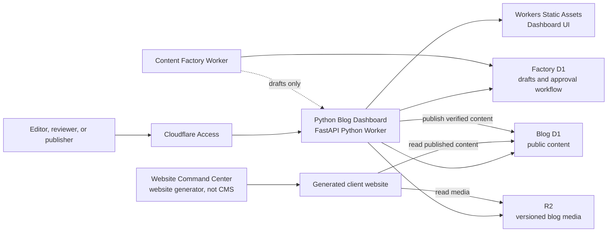

# Python Blog Dashboard — LLM Implementation Specification

**Document type:** Normative implementation specification  
**Audience:** Coding LLM or engineer building the blog control plane  
**Target runtime:** Cloudflare Python Worker with FastAPI and Workers Static Assets  
**Protection:** Cloudflare Access plus application-level authorization  
**Last verified:** 2026-08-28  
**Current state:** Required target component; no Python implementation exists in this repository yet

## 0. Why This Component Exists

Alpha creates or replaces website presentation through the protected Website Command Center at `https://website.alphadigitalagency.id/website`. That tool is a website builder, not a blog CMS.

Therefore the architecture requires a separate **Python Blog Dashboard**. It is the editorial control plane for posts, translations, media, SEO, review, scheduling, publication, and audit history. Generated websites consume published content but do not own editorial workflow.

This separation allows a client's website UI to be replaced without replacing the Blog DB, Factory DB, media, publishing workflow, or editorial dashboard.

## 1. Instructions To The Coding LLM

Give the LLM:

1. this specification;
2. `docs/ALPHA_ARCHITECTURE_LLM_CODING_GUIDE.md`;
3. `docs/BLOG_PLATFORM_LLM_IMPLEMENTATION_SPEC.md`;
4. a completed client manifest;
5. a completed `docs/templates/llm-coding-task.example.md`.

The manifest identifies dashboard Worker/domain/Access resources by non-secret name or ID. Access client secrets, session secrets, and deployment tokens remain outside the manifest.

Use this instruction:

> Build the Python Blog Dashboard in phases under `apps/blog-dashboard/`. Use FastAPI on Cloudflare Python Workers, Workers Static Assets for the dashboard frontend, Cloudflare Access for identity, application roles for authorization, D1 bindings for Blog DB and Factory DB, and an R2 binding for media. Preserve Alpha's legacy production schema through a repository adapter. Do not put Cloudflare API tokens in browser code. Do not publish AI drafts automatically. Never mutate remote resources or deploy without explicit approval. Use local resources and tests first. If a required binding, manifest value, Access claim, or schema contract is missing, stop the affected operation and return a safe error instead of guessing.

## 2. Product Boundary

| Component | Owns | Must not own |
|---|---|---|
| Website Command Center | Website generation, layout, theme, replaceable frontend deployment | Blog editorial state, approvals, post revisions, publish authority |
| Generated website | Public rendering, public routes, metadata, schema, sitemap, read-only published content | Draft mutation, editor login, direct Factory DB access |
| Python Blog Dashboard | Editorial UI, media management, drafts, translations, SEO gates, approvals, scheduling, publishing, audit | Public marketing theme and website generation |
| Content Factory Worker | Research, AI drafting, automated QC, private draft inbox | Automatic production publication |
| Blog DB | Published/scheduled public content and stable public relations | AI work-in-progress and approval state |
| Factory DB | Draft versions, work items, gates, approvals, audit events, publish receipts | Public serving dependency for normal article reads |
| R2 | Versioned media objects | Editorial or publication status as object metadata alone |

The website and dashboard may share a stable content contract, but they must be independently deployable.

## 3. Target Topology



## 4. Deployment Decision

Implement the dashboard as a dedicated Cloudflare Python Worker:

- FastAPI handles dashboard APIs and server routes.
- Workers Static Assets serves the dashboard HTML/CSS/JavaScript build.
- `python_workers` is an explicit compatibility flag.
- `pyproject.toml` and `uv.lock` pin dependencies.
- `pywrangler` handles local development and deployment.
- D1 and R2 are accessed through Worker bindings, not broad account API tokens.
- Cloudflare Access protects the hostname before requests reach the app.

Python Workers are currently a beta platform capability. Keep domain/service interfaces independent from runtime-specific objects so a future runtime change does not require rewriting business rules.

Do not rely on the Python Worker's local filesystem for persistence. It is ephemeral. Durable data belongs in D1 or R2.

## 5. Proposed Repository Layout

```text
apps/blog-dashboard/
├── pyproject.toml
├── uv.lock
├── wrangler.toml
├── README.md
├── migrations/
│   └── <dashboard-specific additive migrations only>
├── public/
│   └── <compiled dashboard assets>
├── src/
│   ├── main.py
│   ├── config.py
│   ├── auth.py
│   ├── errors.py
│   ├── models/
│   ├── repositories/
│   │   ├── blog.py
│   │   ├── legacy_alpha_blog.py
│   │   ├── factory.py
│   │   └── media.py
│   ├── services/
│   │   ├── posts.py
│   │   ├── publishing.py
│   │   ├── translations.py
│   │   ├── seo.py
│   │   └── media.py
│   └── routes/
│       ├── health.py
│       ├── posts.py
│       ├── drafts.py
│       ├── media.py
│       ├── publish.py
│       └── settings.py
└── tests/
    ├── unit/
    ├── integration/
    └── fixtures/
```

Keep SQL in repository modules. Keep HTTP, database mapping, and business/publishing rules separate.

## 6. Binding And Configuration Contract

| Name | Type | Purpose | Browser-visible? |
|---|---|---|---|
| `BLOG_DB` | D1 | Public posts, authors, taxonomy, translations, redirects | No |
| `FACTORY_DB` | D1 | Drafts, revisions, approvals, gates, receipts, audit | No |
| `BLOG_MEDIA` | R2 | Versioned media upload/read/delete lifecycle | No |
| `ASSETS` | Static Assets | Dashboard frontend | Public only after Access authentication |
| `CLIENT_CONFIG` | Non-secret variable or validated config | Client identity, domain, locales, URL policy | Only safe selected fields |
| `ACCESS_AUD` | Variable | Expected Cloudflare Access application audience | No |
| `SESSION_SIGNING_SECRET` | Secret, only if an additional app session is required | App session integrity | No |

The dashboard must not need a general Cloudflare account API token for normal editorial work. Provisioning and deployment credentials belong to a separate operator/CI path with least privilege.

Use separate bindings and resources for local, preview/staging, and production. Alpha IDs and names must not become client defaults.

## 7. Identity And Authorization

### 7.1 Authentication

Cloudflare Access is the external identity gate. The Worker must validate the Access application token and expected audience before trusting identity claims. Do not trust an email header without verified token provenance.

For non-interactive internal calls, use a separately scoped Access service token and a `Service Auth` policy. Do not reuse human credentials.

### 7.2 Roles

Minimum application roles:

| Role | Capabilities |
|---|---|
| `viewer` | Read dashboards, previews, audit, and published content |
| `editor` | Create/edit drafts, translations, SEO fields, and media |
| `reviewer` | Run gates, request changes, approve/reject an immutable draft version |
| `publisher` | Schedule, publish, unpublish through an approved workflow, manage redirects |
| `admin` | Manage dashboard users/roles, client configuration, and emergency recovery controls |

Access decides who can reach the app. The application role decides what that identity can do. Every mutation records the verified identity, role, request ID, timestamp, target, and outcome.

No user may approve and publish their own version when the client policy requires separation of duties.

## 8. Dashboard Functions

### 8.1 Overview

- published, scheduled, draft, blocked, and stale-content counts;
- failed publication receipts and failed content gates;
- missing translation, canonical, hero image, and metadata warnings;
- latest Content Factory runs and draft inbox activity;
- safe D1/R2 health signals without secrets or private content excerpts.

### 8.2 Post management

- searchable/filterable post list by locale, status, pillar, author, and date;
- create and edit a draft;
- autosave or explicit save with optimistic version check;
- preview exact rendered content before approval;
- revision history and diff;
- archive/unpublish with redirect or `410` decision;
- preserve current Alpha URLs until an approved redirect migration exists.

### 8.3 Translation management

- explicit translation group, source locale, and target locale;
- independent localized slug, title, content, metadata, and publish state;
- reciprocal hreflang validation;
- no target design that infers locale only from `-en` suffix.

### 8.4 Media library

- validate MIME type, extension, size, dimensions, and authorized uploader;
- create deterministic, versioned R2 object keys;
- require alt text and optional caption/credit;
- show usage references before deletion;
- never overwrite an immutable published object key;
- reject dangerous file types and mismatched content signatures;
- record upload hash, object key, actor, and timestamp.

### 8.5 Content Factory inbox

- list generated draft versions from Factory DB;
- display research/brief, gates, sources, and generation metadata;
- allow editor changes as a new revision;
- approve or reject one immutable version hash;
- prevent Content Factory from bypassing human approval.

### 8.6 SEO quality control

- canonical and locale URL preview;
- title and description checks;
- Article/FAQ/HowTo schema validation where content qualifies;
- translation/hreflang completeness;
- slug collision and redirect-chain detection;
- indexability, sitemap eligibility, image, author, date, and internal-link gates.

### 8.7 Publication

- schedule in UTC and display editor timezone clearly;
- require an approved artifact hash;
- use an idempotency key and publish receipt;
- write through the correct Blog DB adapter;
- verify the stored public row after writing;
- mark the receipt verified only after hash/field verification;
- trigger or record required cache/sitemap refresh behavior;
- show a permanent failure with recovery action instead of silently retrying forever.

## 9. API Contract

All APIs are under `/api/v1`. JSON responses include `request_id`.

| Method and route | Minimum role | Purpose |
|---|---|---|
| `GET /api/v1/health` | authenticated viewer | Component health without sensitive details |
| `GET /api/v1/me` | authenticated viewer | Verified identity, client, role, permissions |
| `GET /api/v1/posts` | viewer | Paginated/filterable content list |
| `GET /api/v1/posts/{id}` | viewer | Stable post model plus version |
| `POST /api/v1/posts` | editor | Create draft, never directly published |
| `PUT /api/v1/posts/{id}` | editor | Update draft with expected version |
| `GET /api/v1/posts/{id}/revisions` | viewer | Revision history |
| `POST /api/v1/posts/{id}/preview` | editor | Safe preview representation |
| `GET /api/v1/factory/drafts` | editor | Content Factory inbox |
| `POST /api/v1/drafts/{id}/review` | reviewer | Approve/reject exact version hash |
| `POST /api/v1/publish` | publisher | Start idempotent verified publication |
| `GET /api/v1/publish/{receipt_id}` | viewer | Publication state and safe failure category |
| `POST /api/v1/media` | editor | Validated R2 upload |
| `DELETE /api/v1/media/{key}` | publisher/admin | Delete only after reference and policy checks |
| `GET /api/v1/seo/check/{post_id}` | editor | Deterministic SEO gate results |
| `GET /api/v1/audit` | admin or policy-defined viewer | Paginated audit events |

Mutation requests require:

- verified Access identity;
- required role/permission;
- content type and body-size validation;
- Pydantic request validation;
- idempotency key where retry can duplicate work;
- optimistic concurrency/version field for edits;
- structured audit event.

Use `400/422` for invalid requests, `401` for missing/invalid identity, `403` for insufficient permission, `404` for a genuinely missing object, `409` for version/state conflicts, `500` for unexpected failures, and `503` for known temporary dependencies.

## 10. Data And Adapter Rules

The dashboard uses the canonical domain model from the reusable blog specification. It does not expose raw legacy rows to routes or UI.

Required repositories:

- `LegacyAlphaBlogRepository`: maps current `blogdatabase.posts` fields and current live URL conventions;
- `CanonicalBlogRepository`: targets the normalized client schema;
- `FactoryRepository`: draft versions, review/gates, approvals, audit, receipts;
- `MediaRepository`: versioned R2 objects and media metadata.

Alpha's legacy mapping remains a compatibility implementation, not the client schema. Do not alter live `posts` merely to simplify dashboard code.

All values use parameterized D1 statements. Queries select explicit columns, enforce limits, and paginate. Schema changes use additive immutable migrations and local/staging rehearsal.

## 11. Publication State Machine

```text
factory_draft
  -> editing
  -> ready_for_review
  -> approved | rejected | changes_requested
  -> scheduled | publishing
  -> published | publish_failed
  -> archived
```

Rules:

1. every save creates or references a version number and content hash;
2. approval targets one exact immutable hash;
3. any content change after approval returns the item to review;
4. publish is allowed only from an approved/scheduled state;
5. retries reuse the same idempotency key/receipt;
6. Blog DB write is verified before workflow state becomes `published`;
7. failure preserves enough state for safe retry or reconciliation;
8. the two D1 databases are not treated as one SQL transaction.

## 12. Website Integration Contract

Every generated website receives the same read-side contract:

- list eligible published posts by locale with pagination;
- fetch one eligible detail by locale and canonical slug;
- fetch authors, taxonomy, translation alternates, and SEO fields;
- resolve versioned media URLs;
- obtain sitemap-eligible URL records;
- receive correct `404`, `500`, and `503` semantics.

The generated website does not receive dashboard credentials or Factory DB access. Replacing a website must not migrate editorial data. It only rebinds or calls the client's stable read contract and revalidates routes/SEO.

## 13. Security Rules

- Protect all dashboard HTML and APIs with Cloudflare Access.
- Validate Access JWT signature, issuer, expiry, and audience at the application boundary.
- Authorize every endpoint independently; hiding a button is not authorization.
- Keep service-token secrets and signing secrets outside Git and browser bundles.
- Apply CSP, secure headers, same-origin policy, and CSRF protection appropriate to the session model.
- Do not allow arbitrary SQL, arbitrary R2 keys, or arbitrary redirect targets from the UI.
- Sanitize preview/rendering output and uploaded SVG/HTML-like content.
- Redact unpublished article bodies, tokens, cookies, emails, and stack traces from logs.
- Rate-limit mutation, upload, preview, login-related, and expensive search endpoints.
- Record audit events append-only; corrections create a new event.

## 14. Local Development And Quality Gates

The implementation must provide commands equivalent to:

```powershell
Set-Location apps/blog-dashboard
uv sync --locked
uv run ruff check .
uv run pytest
uv run pywrangler dev
uv run pywrangler deploy --dry-run
```

Confirm exact `pywrangler` command support from the pinned toolchain before documenting it as tested.

Tests must include:

- Access token validation and wrong-audience rejection;
- every role/permission boundary;
- Pydantic validation and body limits;
- optimistic concurrency conflicts;
- legacy and canonical repository contract tests using fixtures;
- draft revision and hash stability;
- approve-after-edit rejection;
- idempotent publish retry and partial-failure reconciliation;
- R2 media type/key/reference policies;
- SEO and translation gates;
- correct error/status mapping;
- no Alpha resource IDs or secrets in a client build.

## 15. Implementation Phases

### Phase 0 — Contract and fixtures

- Freeze domain models, current legacy adapter evidence, URL rules, roles, and API schemas.
- Create representative sanitized fixtures.
- No remote writes.

### Phase 1 — Read-only dashboard

- Scaffold Python Worker/FastAPI/static assets.
- Add Access validation and roles.
- Implement health, identity, post list/detail, Factory inbox, and audit reads.
- Prove that no mutation endpoint is exposed.

### Phase 2 — Draft editing and media

- Add revisions, optimistic concurrency, preview, translations, media validation/upload, and audit.
- Keep publication disabled.

### Phase 3 — Review and publishing

- Add deterministic gates, approval hashes, publish receipts, legacy/canonical adapters, scheduling, reconciliation, and rollback behavior.
- Test in isolated staging with copied/sanitized data.

### Phase 4 — Website contract and client replication

- Connect one generated staging website as a read-only consumer.
- Replace its presentation without moving blog data.
- Run route, SEO, media, permission, backup, and recovery acceptance gates.
- Parameterize all client-specific values.

### Phase 5 — Controlled production rollout

- Requires separately approved Access, Worker, D1, R2, DNS, and migration operations.
- Start read-only, then enable editor, reviewer, and publisher permissions progressively.
- Capture smoke tests and rollback evidence.

## 16. Definition Of Done

The Python Blog Dashboard is complete when:

- editors can manage the blog without changing the generated website source;
- generated websites remain replaceable read-only consumers;
- identity is verified by Access and every action is authorized by application role;
- legacy Alpha data works through a compatibility adapter without destructive migration;
- drafts, revisions, translations, media, SEO gates, approvals, publication, and audit are functional;
- AI drafts require human approval and immutable hash verification;
- publication is idempotent and recoverable across two D1 databases;
- local tests, lint/type quality gates, dry-run, and staging acceptance pass;
- client resources and identities are isolated;
- no remote mutation or deployment occurred without explicit approval.

## 17. Platform References

- [Cloudflare Python Workers](https://developers.cloudflare.com/workers/languages/python/)
- [FastAPI on Python Workers](https://developers.cloudflare.com/workers/languages/python/packages/fastapi/)
- [Query D1 from Python Workers](https://developers.cloudflare.com/d1/examples/query-d1-from-python-workers/)
- [Cloudflare D1 Worker Binding API](https://developers.cloudflare.com/d1/worker-api/)
- [R2 bindings in Workers](https://developers.cloudflare.com/r2/api/workers/workers-api-usage/)
- [Cloudflare Access service tokens](https://developers.cloudflare.com/cloudflare-one/access-controls/service-credentials/service-tokens/)
- [Cloudflare Access application-token validation](https://developers.cloudflare.com/cloudflare-one/access-controls/applications/http-apps/authorization-cookie/application-token/)
